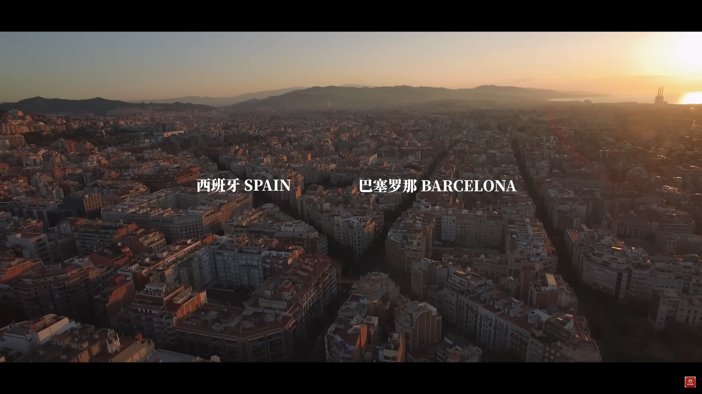
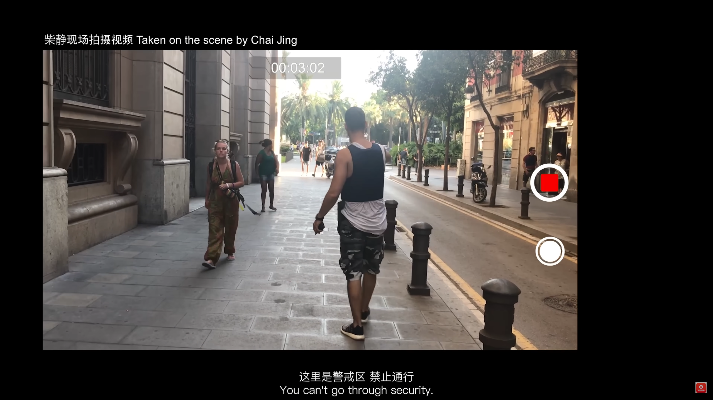
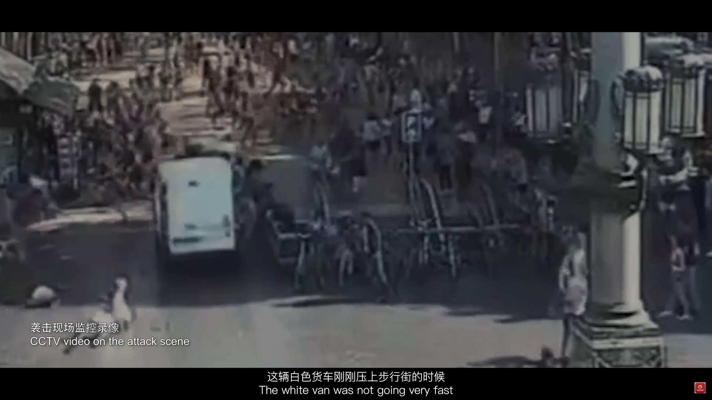
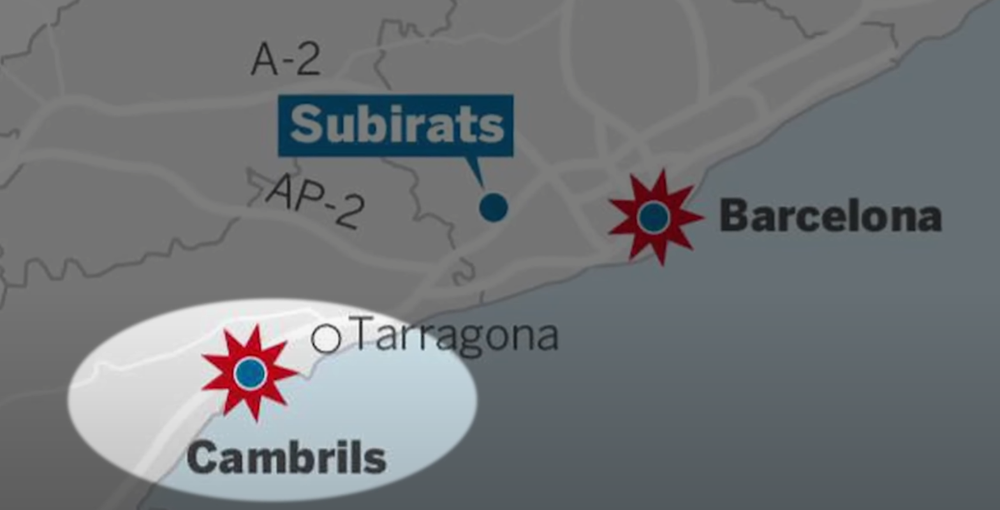
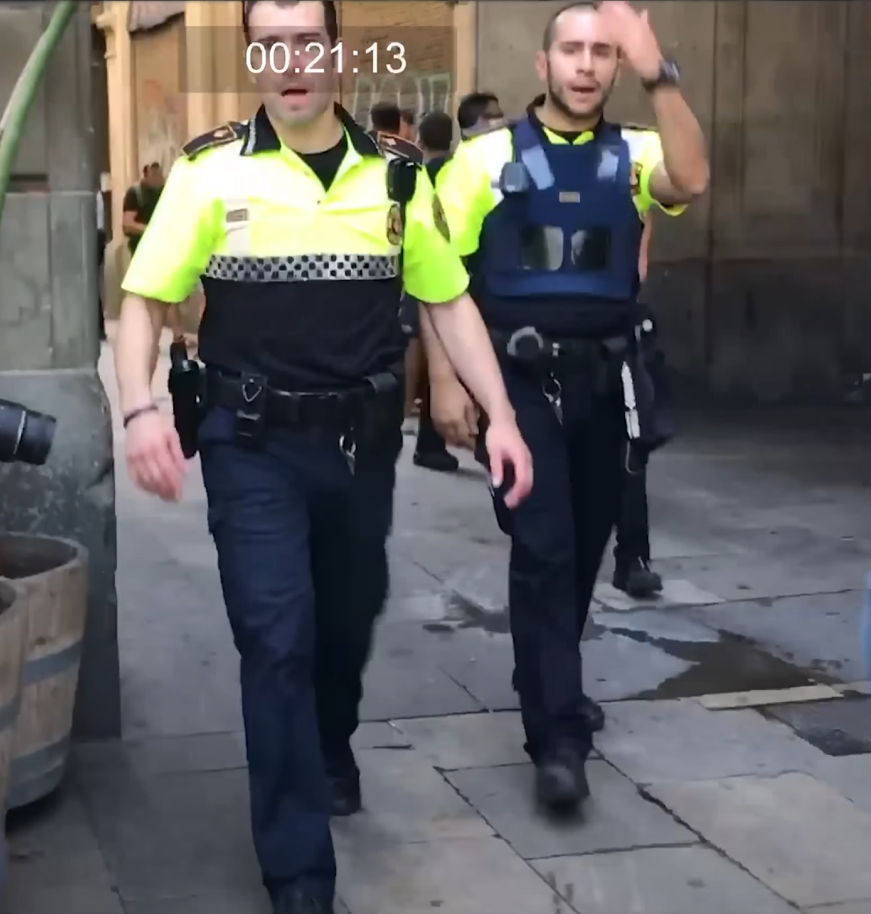

# 第一集   以谁之名？｜Episode 1: In Whose Name?

原片链接：https://www.youtube.com/watch?v=X4otYJGByic&t=266s

2017 年 7 月，柴静女士全家搬到了西班牙的巴塞罗那（Barcelona），住在游客区——兰布拉大道（La Rambla）边上。由于柴 3 岁的爱女喜欢这里的缘故，他们一家暂时安顿了下来。

一个月后（8 月 17 日下午 5 点刚过），柴正在做晚饭。柴收到了正在回家路上的丈夫的短信，被告知是附近好像发生枪击事件了，不要出去。柴立刻推开厨房窗户，听到外边一片喧闹和警笛声。随后又打开电脑搜索突发新闻，报道称 “兰布拉大道发生车辆冲撞，多人受伤。” 由于柴丈夫回家之路必经兰布拉大道，所以柴心急如焚，随后在长达 15 分钟的时间内反复呼叫丈夫无人接听，令她紧张到了极限。

幸亏丈夫无事，到家时满头大汗到。原来是肩扛打印机外加赶路无暇看手机。讲自己是路过兰布拉大道时候是被拦了下来，同时看到二三百人充满惊恐地往外跑，不明所以。柴告诉丈夫是恐袭。

随后西班牙警方开始全城封锁（图中为便衣）、大搜捕。兰布拉大道外围出口处到处都是撤离出来的当地居民。柴在这里坐了 1 小时观察现场，救护车不停地运送受伤人员。这场恐怖袭击中，至少 13 人死亡，超过 130 人受伤。

袭击发生的路段总共不到 800 米，事发白色货车刚刚压上步行街的时候车速不快。在人群被冲散到街道两侧时，这辆车也开始反复拐向两侧，撞击逃避的人群。最终停在兰布拉的中心——米罗马赛克上。这也是巴塞罗那心脏的标志。货车停下来没有别的原因，而是车底盘下的人太多，无法再往前开。

正是此刻，也就是案发后，柴丈夫在兰布拉大道入口处被拦下来。与灾难现场擦肩而过。柴心有余悸地提到，如果丈夫早几分钟进入兰布拉大道——他戴着耳机，肩扛打印机，根本不会听到货车袭来的声音，也无法躲避。

当晚，深夜，柴和丈夫都没睡着，还没从恐慌事件的阴影中走出来。凌晨 02:27，又有了突发新闻。巴塞罗那 100 公里以外的小镇坎布里，再度发生恐袭：一辆奥迪汽车冲入人群，五个人从车里钻出来，绑着疑似爆炸物，用刀和斧无差别袭击，造成 1 名女性死亡，5 位平民及 1 名警察被刺伤。很快 5 人都被击毙，事后证明他们与兰布拉袭击者都是同一组织。                                                                                                       

兰布拉袭击者仍然在逃。次日上午，警方搜捕嫌疑人。一名嫌疑人被抓后，警察示意周围民众后退，理由是担心嫌疑人身上或附近仍然有爆炸物。

很快，嫌疑人照片被公开，令柴大吃一惊。因为这张面孔根本看不出任何凶神恶煞的模样，跟想象中的恐怖分子的模样也完全不一致。柴觉得，如果大街上看到这个人，她只会以为是个学生。

尤尼斯 · 阿布雅克布（Younes Abouyaaqoub），22 岁，工作和收入良好，无犯罪与暴力记录，没有精神病史。

# 第二集   绝路

